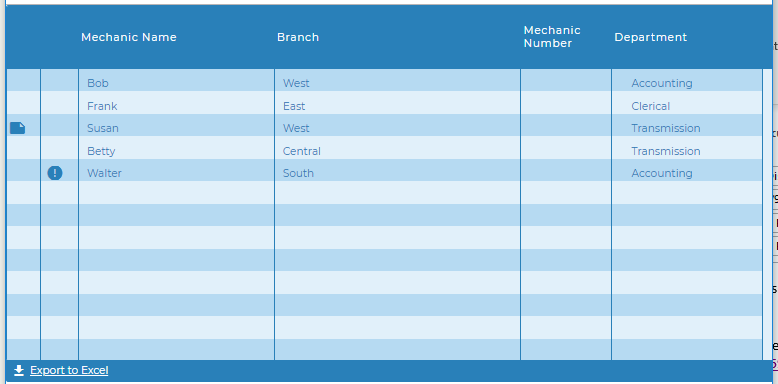

# Responsive example
This project demonstrates two different responsive screens, a responsive grid adjusts size and hides or shows columns as the width of the screen is adjusted, and a responsive edit screen that stacks and rearranges elements based on the screen size.

In addition to the resposive screens the project incorporates several other development concepts:
* Creating and consuming a web service - The mechanic listing is created by consuming the getMechanicList web service.
* pjs.query() with pjs.setFields() - These APIs are used to load the edit screen
* Uploading and displaying images on the edit screen
* Fusion charts - A group of Fusion Chart gauges are used in place of sliders to show the mechanic's proficiency levels in multiple skills.

This project demonstrates creating a page with a more responsive grid through the use of simple container layout widget and a little JavaScript.

## Responsive Grid

The grid is automatically responsive when expand to container is tset to true but this example also uses JavaScript to hide less important columns as the screen size gets smaller to keep the more important columns at a readable size.

### Simple Container Layout widget
Any of the layout widgets can be used to create the same effect but with various appearances. 

In this example the Simple Container Widget was used to add the responsiveness without adding any visual elements, allowing the grid to completely fill the screen.

The Layout is placed on the screen and then the width and height were set to 100%.

The Grid widget, in this case the Blueprint Widget Set Grid Widget was then dropped inside the layout and the property **expand to layout** was set to true.

In addition the paging bar was turned on, adding the page number and export button. 

### The Grid
The example uses the BluePrint Widget Set Grid but any grid will work including the Mobile Grid.
The important things are to set':
* **expand to layout** to true
* **hide columns option** to true

It will be more obvious that the height is adjusting properly if you also turn on the Paging Bar at the bottom. There are a number of properties that will turn on the bottom bar including **show page number**, **show paging controls**, and **export** options. But you can also turn on the bar itself with no other options by setting **show bar** to true. 

### The JavaScript
A JavaScript function was added to the OnLoad() event of the Main screen and is an event listener for window resize is added to call the function anytime the window is resized.

The setColumns() function uses grid apis to hide or show columns based on the pixel width of the window. Removing columns when the width gets smaller give you control over which columns are still visible as the grid is condensed and enables you to keep the most important information visible and readable.

Columns are numbered from left to right starting at 0. Columns will retain the same index id even after other columns are hidden or rearranged by a user (in the case of movable columns).

Because the grid will do it's own resizing some trial and error may be needed to find the best pixel widths to remove columns. 

    window.addEventListener("resize", function(){
      setColumns();
    });
    function setColumns(){
      //make sure there is a Grid1 first
      if(getObj('Grid1')){
        //if window is less than 1542 hide column 7 otherwise show column 7
        if(window.innerWidth < 1542){
          getObj("Grid1").grid.hideColumn(7);
        }
        else{
          getObj("Grid1").grid.showColumn(7);    
        }
        if(window.innerWidth < 1135){
          getObj("Grid1").grid.hideColumn(6);
        }
        .
        .
        .
        see complete function code in the screen OnLoad event property
        .
        .
        .
      }
    }
    setColumns();

## Responsive Edit Screen

The edit screen uses several responsive layouts. The main layout of the epage is a responsive layout allowing each of the sections to be stack and rearrange as desired when the screen size changes.
In addition the Skills section have a seperate responsive layout with each gauge being in a seperate container so that they can be stacked.
The two sections with labels and values tables also contains responsive layouts. These are currently used as table layouts to keep the lables and values lined up. However, if the desire was to allow the screen to collapse to an even skinier size than it currently does these layouts could be used to stack the labels and values.

As you resize the screen you will notice that the mechanic photo always stays on the top row of the screen. The default behaviour of stacking section swould be to stack then left to right from top to bottom. In this case we want the photo at the top and the responsive layout make it very easy to adjust the stacking behaviour.

## Fusion charts

The Visual Designer includes several Fusion Charts widgets in the widget toolbox. However, it is also possible to use any of the charts, gauges, or maps from the Fusion Charts web site.

In order to use a Fusion Chart element that is not in the list you can simply drag any of the chart widgets to the canvas and then change the chart type parameter by first dropping down the list and selecting 'other' and then typing the appropriate name of the chart type. You then follow the informaiton on the Fusion Charts site to determine how to properly populate the chart.
For more information on using Fusion Charts check out this Blog post https://blog.profoundlogic.com/profound-pro-tips-using-charts-with-profound-ui-designer

In this example Spinners are used to adjust the skill levels and therefore the gauge values. Some basic JavaScript was added to update the gauge values when the page opens as well as when the spinner values are changed.

### Update Screen onload()
The onload() event of the Update screen contains JavaScript code that create a JSON object that defines the gauge layout and then loops through all gauges setting the layout and the initial values.

### Spinner onchange()
The Spinner onchange() event is passed a variable that contains the new value of the Spinner. This variable and the spinner name is used to update the appropriate gauge value.

### Spinner onspin()
The onspin() event fires before the value of the spinner has changed so it is not possible to directly set the value of the gauge as with the onchange() event. Instead pui.click() is used to trigger the onclick() event of a hidden 'Refresh Charts' button. The onclick() event of the hidden button contains JavaScript code that loops through the spinners and sets the gauge values. Using a button click to run the JavaScript functions ensures that the Spinner value has changed before the JavaScript runs.

### API reference
---
- [grid.hideColumn()](https://core.profoundlogic.com/docs/pages/viewpage.action?pageId=38731929) - Hide columns
- [grid.showColumn()](https://core.profoundlogic.com/docs/pages/viewpage.action?pageId=38731927) - Show columns
- [getObj()](https://core.profoundlogic.com/docs/pages/viewpage.action?pageId=3276807) - Getting a reference to the grid object
- [pjs.query()](http://www.profoundlogic.com/docs/pages/viewpage.action?pageId=37028376) - Execute an SQL query
- [display.grid.replaceRecords()](http://www.profoundlogic.com/docs/pages/viewpage.action?pageId=33096379) - Clear and add records to a Rich Display Grid
- [pjs.defineDisplay()](http://www.profoundlogic.com/docs/pages/viewpage.action?pageId=31752760) - Create a Rich Display object from json definition
- [display.screen.execute()](http://www.profoundlogic.com/docs/pages/viewpage.action?pageId=31753041) - Display a screen and wait for user to respond
- [Charts](https://core.profoundlogic.com/docs/display/PUI/Charts) - Documentation on using Charts in Rich Displays